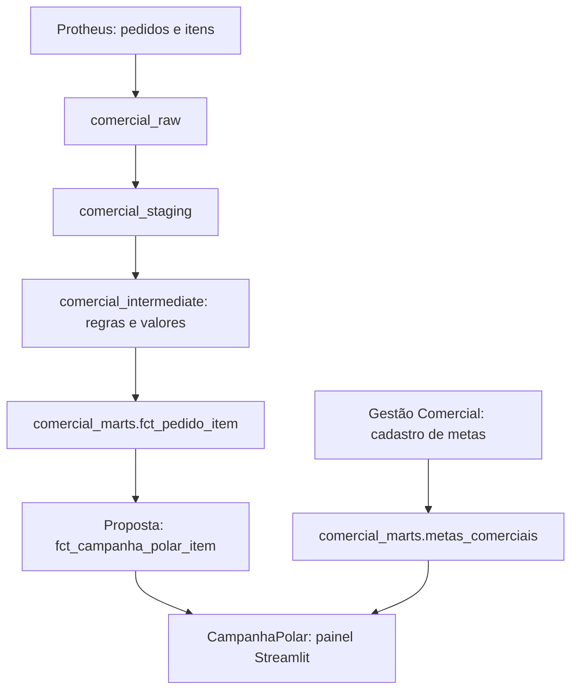

# Estrutura e operação do painel

**Confirmado pelo usuário:** o painel será desenvolvido em Streamlit. Este documento coleta preferências e restrições; não é necessário definir detalhes técnicos agora.

**Painel atualizado em 16/09/2026:** [app.py](../../app.py) reúne visão geral, análise individual por região, Venda no Quadrimestre, clientes novos, clientes reativados, mix de produtos e adiantamento manual. A interface usa o padrão visual do Gestão Comercial. Configuração, testes e situação de implantação estão no [README do projeto](../../README.md).

## Entrada e atualização dos dados

- Como deseja carregar dados: **confirmado pelo usuário**, leitura do Supabase, schema `comercial_marts`.
- Fontes: vendas em `fct_pedido_item` e metas em `metas_comerciais`.
- Elegibilidade financeira: fontes complementares identificadas no código local em 14/09/2026, `vw_clientes_inadimplentes` e `fct_faturamento_item`, para bloqueio por grupo com exceções SMART PODS/MRV e consideração somente da parte faturada de clientes bloqueados. Conferir as chaves e a disponibilidade no banco antes de integrar; contrato em [Elegibilidade de vendas](../dados/elegibilidadeVendas.md).
- Cancelamentos: excluir o pedido inteiro da base analítica elegível e reconstruir realizado, histórico e XP como se ele nunca tivesse sido uma venda válida. Usar as exclusões lógicas e `is_item_valido_metricas` da fonte, mantendo o registro cancelado somente para auditoria.
- Estorno fiscal: preservar o pedido ativo e sua competência original; um refaturamento atualiza a evidência fiscal sem criar outro evento de venda. Para a regra de inadimplência, somar somente itens de notas válidas na fotografia. Validar a detecção técnica do estorno, pois `stg_protheus__sf2` expõe `is_nota_excluida_logicamente`, enquanto `stg_protheus__sd2` filtra itens fiscais excluídos.
- Atualização: reconstruir a apuração com a situação atual das fontes e aplicar mudanças retroativas nas competências originais, inclusive após fechamentos anteriores. Persistir fotografias datadas e motivos de alteração para auditoria, sem usá-las para congelar o resultado corrente. Manter o adiantamento manual fora desse recálculo automático.
- Devoluções: fonte `fct_nota_devolucao`, com valor alocado por vendedor a partir da nota original. Incluir todas as devoluções no abatimento, sem aplicar filtro por setor responsável, motivo, tipo ou classificação; esses atributos servem somente para auditoria da campanha. Abater na competência de implantação do pedido e recalcular os XP, conforme confirmado. A saída observada não contém produto/item nem filial/pedido, por isso o vínculo à venda original precisa ser validado e o mix exige detalhe adicional.
- Operações não comerciais: `fct_pedido_item` e `fct_faturamento_item` expõem `is_venda_comercial`, `is_remessa`, `is_transferencia` e `is_bonificacao` a partir da classificação CFOP. Excluir bonificações, remessas e transferências de mercadoria de vendas, histórico elegível e XP; manter `classe_operacao` e `cfop_classificacao` para auditoria.
- Calendário do acompanhamento mensal: segunda a sexta, descontando feriados nacionais, conforme confirmado em 14/09/2026. Referência local em [Calendário da campanha](../dados/calendarioCampanha.md) e [feriadosNacionaisCampanha2026.csv](../dados/feriadosNacionaisCampanha2026.csv); recalcular a meta parcial e os XP de vendas para a data de referência, mesmo sem novas vendas.
- Armazenamento principal: tabelas no Supabase. Necessidade de exportações ou cópias locais a definir.
- Participação: derivar por competência de `metas_comerciais`, com `meta > 0` e `time` em `Canais`, `Time Norte` ou `Time Sul`. Não criar participantes a partir de vendedores ativos sem meta; relacionar os vendedores somente depois de definir as regiões elegíveis.
- Ciclo do vendedor: não filtrar a apuração histórica pelo estado atual `ativo`. Admitidos e desligados mantêm as vendas e os XP elegíveis de seu período, sem proporcionalizar tetos ou metas pelo tempo de participação.
- Adiantamento manual: tabelas `campanha_polar_adiantamento` e `campanha_polar_adiantamento_historico`, no schema `comercial_marts`, mantidas pelo aplicativo. Os três campos booleanos são a decisão final das contas autorizadas; não calcular datas de encerramento nem validar percentuais contra vendas. A tela lista somente regiões elegíveis pela meta da competência. O Streamlit usa funções RPC da Data API com o JWT autenticado, sem senha de banco. [SQL de criação](../../sql/adiantamento_meta.sql) preparado; aplicação no banco depende da configuração do ambiente. Não reconstruir essas tabelas no dataflow.
- Quem fará a atualização: [PREENCHER]
- Frequência necessária: [PREENCHER]
- É necessário guardar versões anteriores para conferência: [PREENCHER]
- Volume observado em 09/09/2026: 125.056 linhas em `fct_pedido_item` e 502 em `metas_comerciais`, antes dos filtros da campanha.

### Fluxo das fontes

O código do dataflow e do Gestão Comercial foi examinado; tabelas e disponibilidade foram conferidas por conexão PostgreSQL somente leitura em 09/09/2026. A tela de adiantamento passou a usar Supabase Auth e Data API em 15/09/2026; ainda precisa dos dois secrets públicos no ambiente e da execução do SQL no projeto. As demais integrações permanecem para as próximas etapas. Os contratos e pendências estão em [dadoVenda.md](../dados/dadoVenda.md) e [dadoMeta.md](../dados/dadoMeta.md).

A [tabela derivada de enquadramento](../dados/dadoEnquadramento.md), proposta em 10/09/2026, poderá materializar futuramente a classificação unificada dos pedidos. As páginas atuais calculam novos, reativados e mix sob demanda por funções da Data API, documentadas nas respectivas visões de [clientes novos](../dados/visaoClientesNovos.md), [clientes reativados](../dados/visaoClientesReativados.md) e [mix de produtos](../dados/visaoMixProdutos.md).

## Acesso e uso

- Onde o painel será executado: computador local, servidor interno ou outro ambiente: [PREENCHER]
- Número aproximado de usuários: [PREENCHER]
- Login do painel: **confirmado pelo usuário em 15/09/2026**, e-mail e senha do Supabase Authentication, usando as contas cadastradas em `auth.users`. O aplicativo autentica pela API oficial e não consulta diretamente o schema `auth`.
- Permissões do adiantamento, ampliadas em 16/09/2026: `lais.vendrasco@ambar.tech`, `leonardo.watanabe@ambar.tech`, `jorge.castro@ambar.tech`, `anyelle.santos@ambar.tech` e `luis.oliveira@ambar.tech` editam e salvam; os demais usuários autenticados consultam. O servidor revalida a sessão, e a função SQL confere a permissão diretamente no JWT em cada gravação.
- Uso principal em computador, celular ou ambos: [PREENCHER]
- Há restrições para armazenamento ou exibição dos dados: [PREENCHER]

## Organização das telas

Descreva as telas desejadas em linguagem simples. Exemplos possíveis: visão geral, resultado individual, ranking e detalhamento dos pontos.

| Tela desejada | O que deve mostrar | Quem pode acessar |
| --- | --- | --- |
| Visão geral | Cartão do realizado elegível de 2026 contra o budget anual de R$ 119 milhões; ranking decrescente dos cinco indicadores, total e classificação por região | Usuários autenticados consultam |
| Análise individual | Filtro regional, XP total, classificação, composição em barras horizontais e detalhes de clientes novos, reativados, mix, venda e adiantamento | Usuários autenticados consultam |
| Venda no Quadrimestre | Meta e realizado acumulados desde setembro, com o mês atual proporcional aos dias úteis, atingimento exato, XP e dias úteis em indicador no topo | Usuários autenticados consultam |
| Clientes novos | Resumo de quantidade, lista e XP por região; detalhe de data, grupo, pedidos, vendedor, região, segmento, atribuição e XP | Usuários autenticados consultam |
| Clientes reativados | Resumo de quantidade, lista e XP por região; detalhe do retorno por vendedor, com duas linhas para triangulações | Usuários autenticados consultam |
| Mix de produtos | Resumo das expansões confirmadas por região; detalhe de família, produtos, mínimo, resultado e XP por vendedor | Usuários autenticados consultam |
| Adiantamento de meta | Uma linha por região e 12 checks: três fases para cada mês de setembro a dezembro | Usuários autenticados consultam; as cinco contas editoras autorizadas salvam |

## Identidade visual

- Logo e imagens disponíveis na pasta assets: `assets/logo_polar_horizontal.png`, copiado da referência local do Gestão Comercial.
- Cores e referências visuais: **confirmado pelo usuário em 14/09/2026**, seguir o padrão do Gestão Comercial: azul Polar `#0072D6`, azul escuro `#005DAD`, fundo branco, cartões com borda azul, cabeçalhos de tabela azuis, texto principal `#17233A` e fundo secundário `#F4F8FC`.
- Nome exibido: `Campanha Polar`; navegação com visão geral, análise individual, Venda no Quadrimestre, novos, reativados, mix e adiantamento. A barra lateral exibe a data da última atualização do painel no fuso de São Paulo, compartilhada como referência pelas telas de budget e vendas.

## Operação e manutenção

- Quem será responsável pelo painel depois de pronto: [PREENCHER]
- Como o usuário deve perceber erro de carga ou dados desatualizados: [PREENCHER]
- Outros sistemas com que o painel precisa se integrar: [PREENCHER]
- Outras restrições ou preferências: [PREENCHER]
