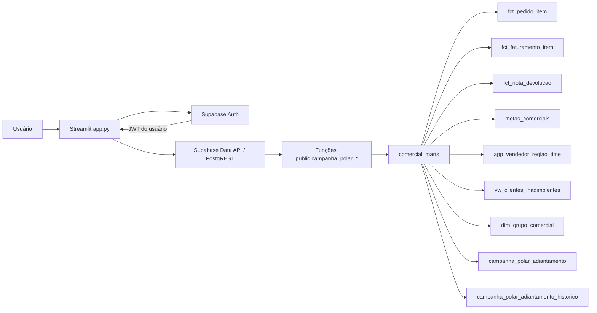

# Arquitetura, dados e contratos

## Visão geral

A interface não acessa as tabelas analíticas diretamente, exceto `cpv_refresh_controle`, consultada pelo cliente autenticado. Os indicadores usam funções RPC `security definer` no schema `public`.

## Componentes Python

| Módulo | Responsabilidade | Efeito colateral |
| --- | --- | --- |
| `app.py` | Páginas, formatação, consolidações, classificação e estado da interface | Renderiza UI e mantém sessão Streamlit |
| `polar.autenticacao` | Cria clientes isolados, autentica, revalida e encerra sessão | Chama Supabase Auth |
| `polar.atualizacao` | Lê o marcador de atualização | Consulta `cpv_refresh_controle` |
| `polar.budget` | Valida o retorno do budget e calcula percentual | Chama uma RPC |
| `polar.vendas` | Valida retorno, calcula dias úteis, acumulado e XP | Chama uma RPC por mês |
| `polar.clientes_novos` | Valida o contrato de novos | Chama uma RPC |
| `polar.clientes_reativados` | Valida o contrato de reativados | Chama uma RPC |
| `polar.mix_produtos` | Valida o contrato de mix | Chama uma RPC |
| `polar.adiantamento` | Identidade, permissões, validação, leitura e gravação | Chama RPCs de leitura/gravação |

## Fontes de dados

| Fonte | Grão usado | Uso |
| --- | --- | --- |
| `comercial_marts.fct_pedido_item` | Item/alocação de pedido | Histórico, venda bruta, produto, grupo, cliente, vendedor e flags comerciais |
| `comercial_marts.fct_faturamento_item` | Item/alocação faturada | Parte faturada de cliente bloqueado e vínculo nota–pedido |
| `comercial_marts.fct_nota_devolucao` | Nota devolvida/alocação de vendedor | Abatimento monetário e detecção de devolução no mix |
| `comercial_marts.metas_comerciais` | Região + competência, podendo haver múltiplas linhas | Participação e meta regional somada |
| `comercial_marts.app_vendedor_regiao_time` | Cadastro de vendedor | Nome, região, time e segmento |
| `comercial_marts.vw_clientes_inadimplentes` | `cliente_loja_id` | Estado corrente de bloqueio |
| `comercial_marts.dim_grupo_comercial` | Grupo comercial | Validação e nome do grupo |
| `comercial_marts.campanha_polar_adiantamento` | Competência + região | Versão atual dos checks manuais |
| `comercial_marts.campanha_polar_adiantamento_historico` | Competência + região + versão | Auditoria das alterações |
| `cpv_refresh_controle` | Chave de processo | Último refresh exibido na lateral |

## Funções RPC

| Função | Parâmetro | Retorno principal | Acesso |
| --- | --- | --- | --- |
| `campanha_polar_carregar_budget_anual()` | Nenhum | uma linha: data e realizado | autenticado |
| `campanha_polar_carregar_vendas_regionais(date)` | primeiro dia da competência | uma linha por região participante | autenticado |
| `campanha_polar_carregar_clientes_novos(date)` | competência ou `null` | uma linha por atribuição de vendedor | autenticado |
| `campanha_polar_carregar_clientes_reativados(date)` | competência ou `null` | uma linha por atribuição de vendedor | autenticado |
| `campanha_polar_carregar_mix_produtos(date)` | competência ou `null` | uma linha por família/evento/vendedor | autenticado |
| `campanha_polar_carregar_adiantamento(date)` | primeiro dia da competência | uma linha por região com meta | autenticado |
| `campanha_polar_salvar_adiantamento(date,jsonb)` | mês e lote | quantidade de linhas alteradas | cinco editores |
| `campanha_polar_salvar_adiantamento_campanha(jsonb)` | lote com os quatro meses | quantidade total alterada | cinco editores via função mensal |

As funções analíticas têm `statement_timeout = '60s'`. As funções de adiantamento não definem timeout próprio. Todas usam `set search_path = ''` e nomes qualificados.

## Contratos de retorno

### Budget

| Campo | Tipo lógico | Regra |
| --- | --- | --- |
| `data_referencia` | data | data corrente em America/Sao_Paulo |
| `realizado` | decimal | venda bruta de 2026 menos devoluções de 2026 |

O cliente acrescenta `budget = 119000000` e `atingimento_pct`.

### Vendas regionais

| Campo | Tipo lógico | Regra |
| --- | --- | --- |
| `data_referencia` | data | menor entre hoje e fim da competência |
| `regiao` | texto | região com meta positiva |
| `time` | texto | time único ou `Múltiplos times` |
| `meta` | decimal | soma das linhas de meta da região |
| `realizado` | decimal | venda líquida elegível alocada na região |
| `vendedores` | texto | nomes distintos separados por ` · ` |

O Python acrescenta dias úteis, metas parcial/acumulada, saldo, necessidade diária, atingimento e XP.

### Clientes novos

`grupo_comercial_id`, `nome_grupo_comercial`, `data_primeira_compra`, `pedidos`, `vendedor`, `regiao`, `segmento`, `situacao_atribuicao`, `xp`.

### Clientes reativados

`grupo_comercial_id`, `nome_grupo_comercial`, `data_reativacao`, `data_ultima_compra`, `prazo_meses`, `pedidos`, `vendedor`, `regiao`, `segmento`, `situacao_atribuicao`, `xp`.

### Mix

`grupo_comercial_id`, `nome_grupo_comercial`, `data_expansao`, `data_primeira_compra_familia`, `grupo_mix`, `produtos`, `pedidos`, `vendedor`, `regiao`, `segmento`, `valor_linha_elegivel`, `valor_minimo`, `situacao_evento`, `xp`.

### Adiantamento

`regiao`, `time`, `meta`, `semana_1_32`, `semana_2_56`, `semana_3_80`, `observacao`, `versao`, `atualizado_em`, `atualizado_por`.

O cliente rejeita retorno que não seja lista/linha no formato esperado e orienta reaplicar o SQL quando faltam campos.

## Grãos e chaves

| Conceito | Chave efetiva |
| --- | --- |
| Pedido | `filial_id + pedido_id` |
| Evento de cliente | `grupo_comercial_id + data_emissao` |
| Evento de mix | `grupo_comercial_id + data_emissao + grupo_mix` |
| Primeira compra de família | `grupo_comercial_id + grupo_mix` |
| Meta | consolidada por `competencia + regiao` |
| Venda regional | `competencia + regiao` |
| Check atual | `competencia + regiao` |
| Histórico de check | `competencia + regiao + versao` |

## Consolidação no aplicativo

A Visão geral faz estas transformações fora do banco:

1. carrega os quatro meses de adiantamento;
2. carrega clientes novos, reativados e mix da campanha inteira;
3. carrega vendas desde setembro até o mês de referência;
4. calcula o XP acumulado de vendas por região;
5. soma XP individual por `(região, vendedor)` e aplica teto de 100/80;
6. soma o XP sem teto de mix por região;
7. soma 10 por check de adiantamento;
8. soma os cinco indicadores e atribui classificação regional;
9. ordena por XP total decrescente e região crescente.

Não há persistência do total consolidado. Cada abertura recalcula a partir da situação atual.

## Páginas

| Página | Conteúdo |
| --- | --- |
| Visão geral | cartão de budget e ranking regional dos cinco indicadores |
| Análise individual | seletor de região, total, classificação, barras e cinco tabelas de detalhe |
| Venda no Quadrimestre | indicadores agregados e tabela regional do acumulado |
| Clientes novos | resumo regional e linhas de atribuição |
| Clientes reativados | resumo regional e linhas de atribuição |
| Mix de produtos | resumo apenas de elegíveis e detalhe de todas as compras mapeadas |
| Adiantamento de meta | 12 checks por região, últimas atualizações e salvamento |

Não existe filtro global de competência. As consultas de novos, reativados e mix são chamadas com competência nula nas páginas atuais.

Nos resumos de novos e reativados, cada grupo retornado é contado uma vez por região, mesmo quando sua linha tem zero XP por pendência. Um evento entre duas regiões é contado em ambas. No resumo de mix, somente linhas com XP maior que zero são contadas. As tabelas detalhadas preservam as linhas por vendedor.

Na exibição dos pedidos, o prefixo da filial padrão `01101/` é removido. Pedidos de outras filiais preservam o prefixo. Essa transformação é apenas visual; o SQL continua usando filial + pedido como chave.

## Cache e volume de chamadas

Não há cache global de consultas. Cada rerun relevante do Streamlit volta a consultar as RPCs. A Visão geral e a Análise individual fazem as chamadas mais amplas: budget quando aplicável, quatro leituras de adiantamento, três consultas de clientes/mix e uma consulta de vendas por competência decorrida. A página de adiantamento mantém os registros no `session_state` apenas durante a sessão e os recarrega depois de salvar ou quando o usuário solicita.

Esse desenho privilegia a situação atual dos dados, mas aumenta tempo e volume de chamadas. Alterações de performance devem preservar a invalidação correta após refresh, mudança de usuário e salvamento.

## Identidade visual

- Cor principal: `#0072D6`.
- Azul escuro: `#005DAD`.
- Texto principal: `#17233A`.
- Fundo secundário: `#F4F8FC`.
- Logo: `assets/logo_polar_horizontal.png`.
- Favicon: `assets/icone_polar.png`.
- Tema Streamlit: claro, layout largo e servidor headless.

## Atualização e datas

- Budget e vendas usam “hoje” no fuso de São Paulo dentro do SQL.
- O aplicativo calcula sua referência no fuso de São Paulo.
- Clientes e mix usam `current_date` do banco, sem conversão explícita de fuso.
- A lateral consulta as chaves `dataflow_cpv_public` e `totvs_supabase`, ordena por `atualizado_em` decrescente e mostra `finalizado_em`, com fallback para `atualizado_em`.
- A consulta de refresh não filtra explicitamente o status do processo.

## Artefatos históricos

Os arquivos `previaClientes*` e `previaMix*` foram gerados por consultas de 10/09/2026. Eles servem para auditoria do levantamento inicial, não são lidos pela aplicação e não devem ser usados como resultado oficial corrente.
